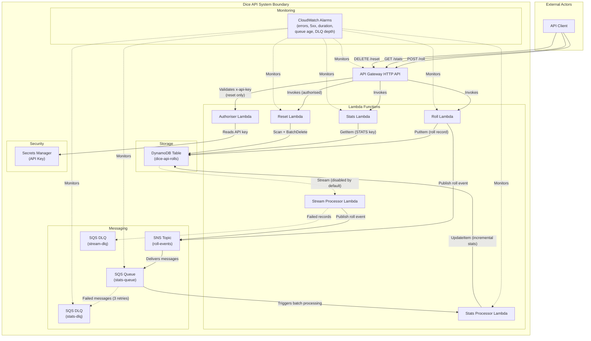

# C4 Container Diagram

## Description

This C4 Container diagram shows the Dice API system deployed in AWS. The system is a workshop demonstration of multiple AWS services working together:

- **API Gateway** exposes three HTTP endpoints for rolling dice, viewing stats, and resetting the table
- **Lambda functions** handle each concern independently with ARM64 architecture
- **DynamoDB** stores individual roll records and an aggregated stats record using single-table design
- **SNS + SQS** decouple the roll event from stats computation, processing asynchronously
- **DynamoDB Streams** provides an alternative event source (disabled by default, toggled for workshop)
- **Secrets Manager** stores the API key used by the authoriser Lambda
- **CloudWatch Alarms** monitor errors, latency, and queue health across all components

Dashed lines indicate optional/disabled paths or monitoring relationships.
